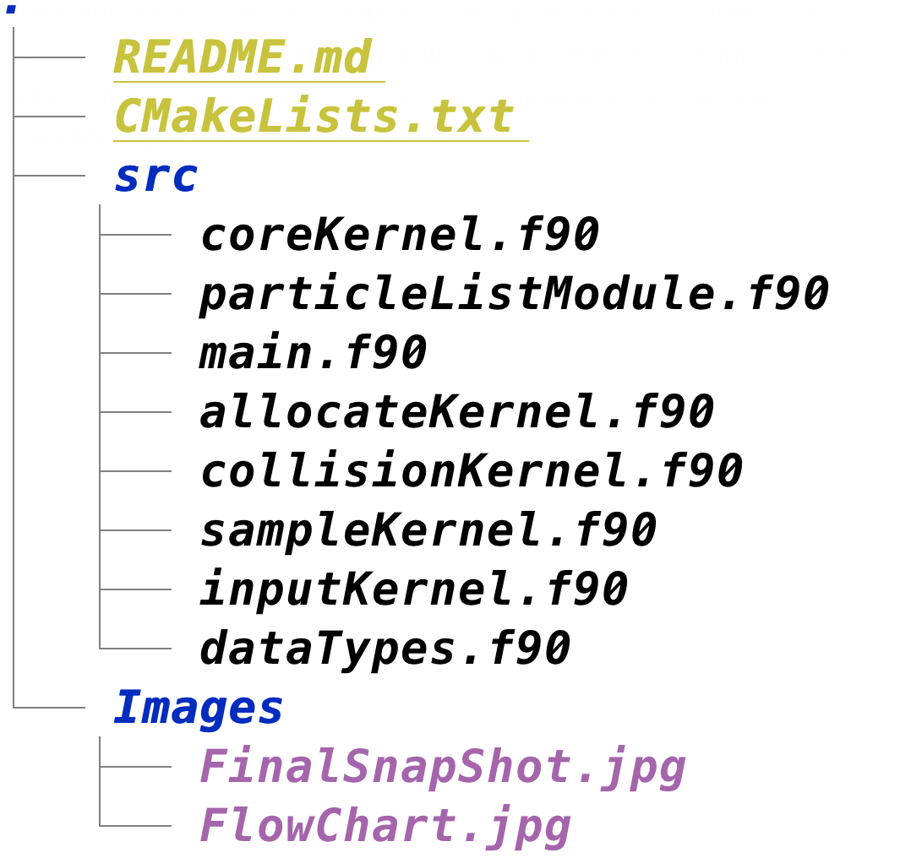
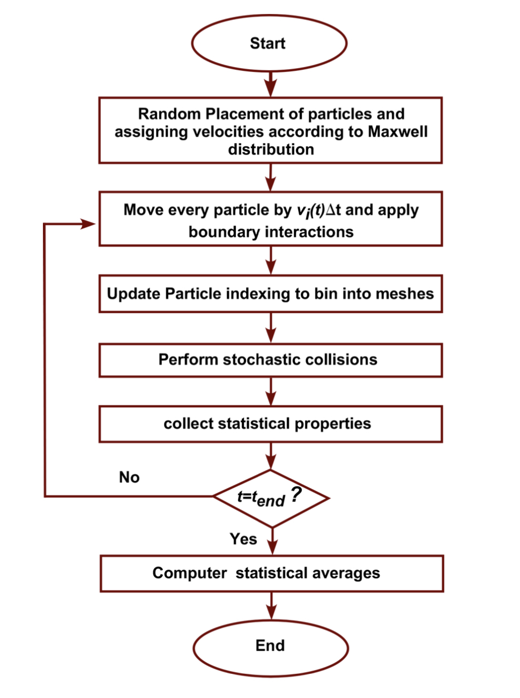
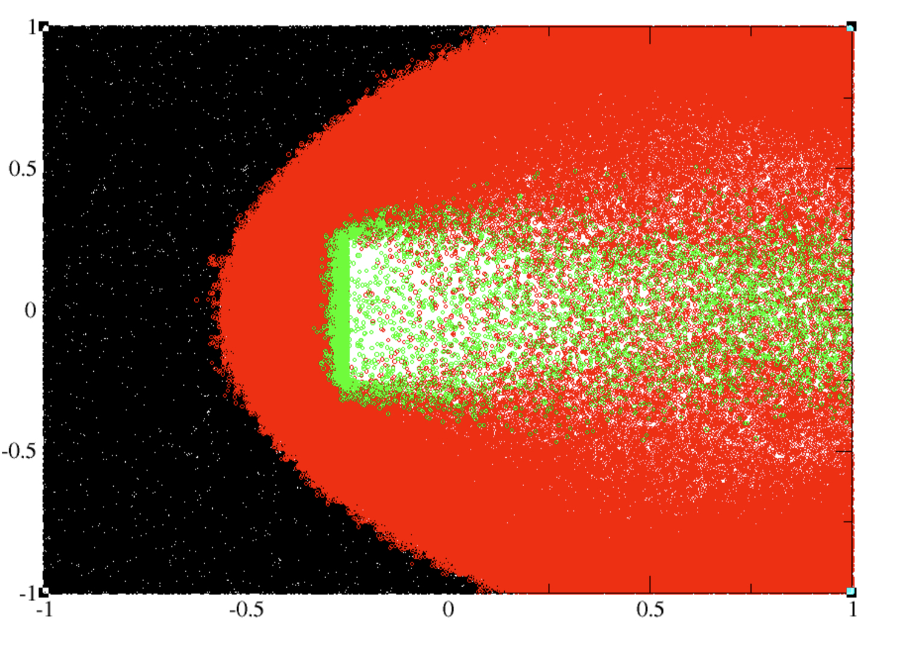

### Direct Simulation Monte Carlo
--- 

### Code Organization
---

 

&nbsp;
&nbsp;

### Installation
---

```bash 
git clone https://github.com/masrul/DSMC
cd DSMC 
mkdir build && cd build 
cmake .. -DCMAKE_INSTALL_PREFIX=/path-to-bin/ 
make && make install 
```

### Theory
--- 

Direct simulation monte Carlo is a popular N-body simulation technique to simulate dilute or rarefied gas. This simulation method has found quite interest to study problem in field of aerospace engineering, nano particle transport, hypersonic moving objects, heat transfer etc. Flow chart of DSMC is shown in Fig-1. In Fig-2, final snap shot of DSMC is shown. Here, rarefied gas is flowing between two slabs, where gas faces obstacle with parpendicular slab. 

|  |
|:--:| 
| **Fig-1:** Flow chart of DSMC |


|  |
|:--:| 
| **Fig-2:** Final snapshot of DSMC simulation. Color represents velocity |

Reference
--- 
 + Alexander, F.J. and Garcia, A.L., 1997. The direct simulation Monte Carlo method. Computers in Physics, 11 (6),pp. 588-593  

